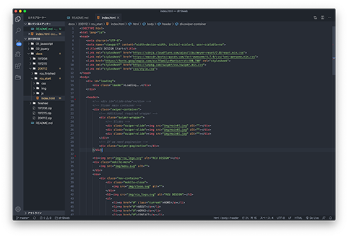
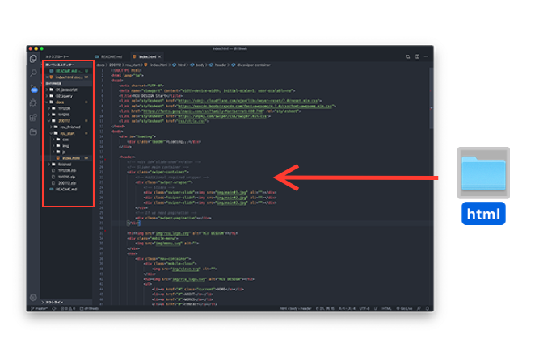
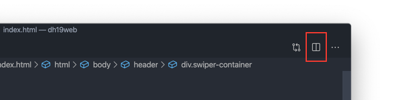
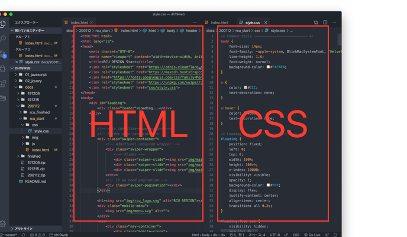
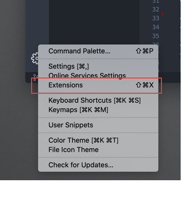
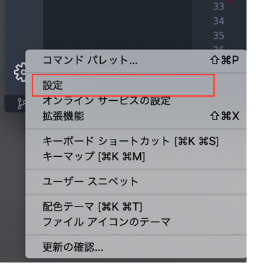

&nbsp; &nbsp;
marp: true
&nbsp; &nbsp;

# Visual Studio Code

Let's Cording!

&nbsp; &nbsp;

# コードエディタ Visual Studio Code

[Visual Studio Code ダウンロード](https://azure.microsoft.com/ja-jp/products/visual-studio-code/)

&nbsp; &nbsp;

# Visual Studio Code の特徴

* マイクロソフト製（Macとも相性は良い）
* 軽量！とにかく軽い
* 業界標準（プロはDreamweaverは使いません）
* 無料
* 機能拡張が豊富
* カスタマイズができる

&nbsp; &nbsp;

# プロジェクトの作成

* ドラッグするだけ！

&nbsp; &nbsp;

# 画面分割

&nbsp; &nbsp;

# よく使うショートカット

* `cmd` + `+` 文字拡大　（逆は`-`）
* `cmd` + `d` 複数選択
* `opt` + `shift` + `↓` 行コピー

* `cmd` + `]` インデント。もしくは `cmd` + `tab`
* `cmd` + `[` インデントを戻す。もしくは `cmd` + `shift` + `tab`

&nbsp; &nbsp;

# 機能拡張の追加

  便利な機能を追加して自分好みにカスタマイズできる

&nbsp; &nbsp;

# 便利な機能拡張

* `Japanese Language Pack` インターフィエスを日本語化
* `Project Manager` よく使うプロジェクトを登録
* `Path Intellisense` ファイルを探す
* `Path Autocomplete` 候補を表示する
* `zenkaku` 全角スペースを表示してくれる
* `Live Server` ローカルサーバー経由でプレビュー

&nbsp; &nbsp;

# 環境設定

* 環境設定をカスタマイズすることで、より使いやすくする
* 慣れてきたらショートカット `cmd` + `,`

&nbsp; &nbsp;

# 環境設定

## エディタ
* Editor: Render Whitespace 半角スペースを表示させておく
* "editor.wordWrap": "on", //エディターの幅で行を折り返し

## emmet
* Emmet: Trigger Expansion On Tab タブでEmmetを実行する

&nbsp; &nbsp;
